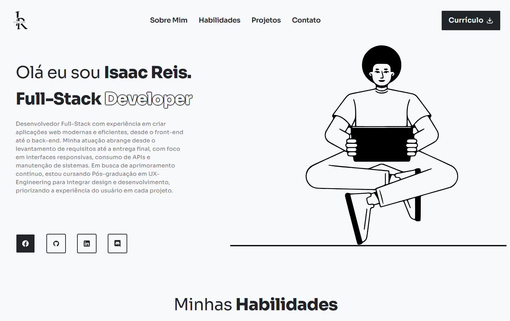

# Meu Portfólio Pessoal

  

  Este é o repositório do código-fonte do meu portfólio pessoal, onde apresento minhas habilidades, projetos e informações de contato.

## 📋 Índice

- [Sobre o Projeto](#-sobre-o-projeto)
- [Funcionalidades](#-funcionalidades)
- [Construído Com](#-construído-com)
- [Contato](#-contato)

## 📖 Sobre o Projeto

Este projeto foi criado para ser meu cartão de visitas digital. O objetivo é centralizar minhas informações profissionais, exibir os projetos dos quais me orgulho e facilitar o contato para oportunidades de trabalho e colaboração.

## ✨ Funcionalidades

- **Design Responsivo:** Totalmente adaptável para desktops, tablets e celulares.
- **Seção de Projetos:** Galeria com meus principais trabalhos, incluindo links para o código e demonstrações ao vivo.
- **Listagem de Habilidades:** Apresentação das tecnologias que domino.
- **Formulário de Contato:** Uma maneira fácil de entrar em contato comigo.

## 🛠️ Construído Com

- **HTML5**
- **CSS3**
- **JavaScript**

## 📫 Contato

Você pode me encontrar nas seguintes plataformas:

- 💼 **LinkedIn:** https://www.linkedin.com/in/isaacnreis/
- 📧 **Email:** isaacreisn@gmail.com
- 🌐 **Website:** https://isaacnreis.github.io/portfolio-n/
